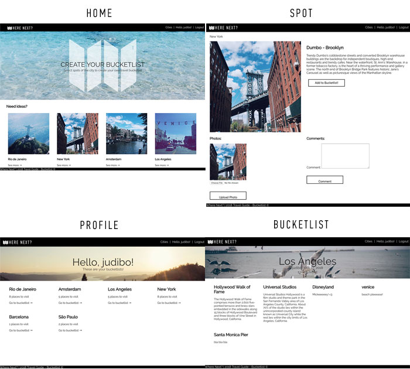

# Where Next? 

## Description
Create bucketlist of spots to visit in a city to keep track of what the user have completed or not.
The user can add spots and cities to the app.

## Screenshot
 

## Technologies Used
 * HTML
 * CSS
 * Python
 * Django
 * Heroku
 * Boto3
 * AWS

 ## Links
 * [Trello](https://trello.com/b/uayxi3mD/travel-guide-bucketlist)
* Start creating your Cities Bucketlists - [Where Next](https://wherenextbucketlist.herokuapp.com/) 

## Future features (ice box)
 * Create a Map with the cities, showing where the user want to go or have been
 * Rate the spot (stars)
 * User be able to duplicate an existing bucketlist
 * Filter the spots on the genre (things to do, restaurants, bars...)
 * On the spot page, set a default image and that image doesn't show on the photo gallery.